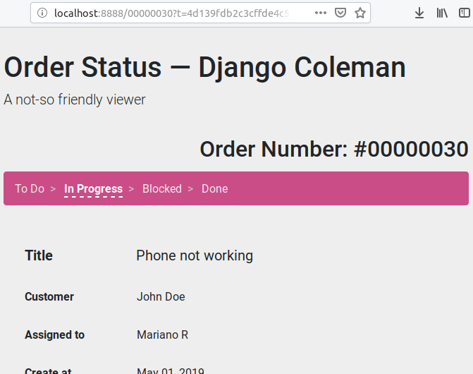

(Tornado) Django Coleman Viewer
===============================

**IN PROGRESS**: Simple web application to view task orders from
`Django Coleman <https://github.com/mrsarm/django-coleman>`_,
built with `Tornado Framework <https://www.tornadoweb.org/en/stable/>`_.

This is just a PoC using Tornado web framework and
Python 3+ async programming, and Django Coleman as API,
it's not a full featured, production ready application.

Requirements
------------

Docker, or:

* Python 3.8+
* Tornado framework installed (tested with version 6 and 6.1)
* Django Coleman running at the URL pointed
  by the ``DCOLEMAN_ENDPOINT`` environment
  variable (by default it uses ``http://localhost:8000/api/v1``)

Install and Run
---------------

Install ``tornado`` with::

   $ pip3 install tornado

(use virtual environments!)

Run with::

   $ ./app.py

Run changing the Django Coleman endpoint with::

   $ DCOLEMAN_ENDPOINT=http://HOSTNAME/api/v1 ./app.py

Access the application
----------------------

If the order number is *123*, the URL to access
it is: http://localhost:8888/123?t=porgs

The argument ``t`` is the master token, by default ``porgs``...

.. image:: https://media.giphy.com/media/3ohhwqOVlEbBxEbss0/giphy.gif

... but each time Django Coleman creates an order, it sends an
email with the order URL signed with a unique token so users cannot
reuse the token to see other orders.

Settings
--------

+-------------------------------------+----------------------------------+--------------------------------------------------------------+
| **Environment variable**            | **Default value**                | **Description**                                              |
+-------------------------------------+----------------------------------+--------------------------------------------------------------+
| ``DCOLEMAN_ENDPOINT``               | ``http://localhost:8000/api/v1`` | Django Coleman API URL                                       |
+-------------------------------------+----------------------------------+--------------------------------------------------------------+
| ``DCOLEMAN_MASTER_TOKEN``           | ``porgs``                        | Master token (**CHANGE IT** in production)                   |
+-------------------------------------+----------------------------------+--------------------------------------------------------------+
| ``DCOLEMAN_TASKS_VIEWER_HASH_SALT`` | ``1two3``                        | Same value than ``TASKS_VIEWER_HASH_SALT`` in Django Coleman |
+---------------------------+---------+----------------------------------+--------------------------------------------------------------+

Docker
------

A reference `<Dockerfile>`_ is provided, and the image published
in `Docker Hub <https://hub.docker.com/r/mrsarm/django-coleman-mtasks-viewer>`_.

Also a ``compose.yaml`` in the
`dcoleman-e2e <https://github.com/mrsarm/dcoleman-e2e>`_ project is provided,
you can build and run the app with Docker Compose with::

    $ docker compose up

About
-----

**Project**: https://github.com/mrsarm/tornado-dcoleman-mtasks-viewer

**Authors**: (2019-2024) Mariano Ruiz <mrsarm@gmail.com>

**License**: AGPL-v3
